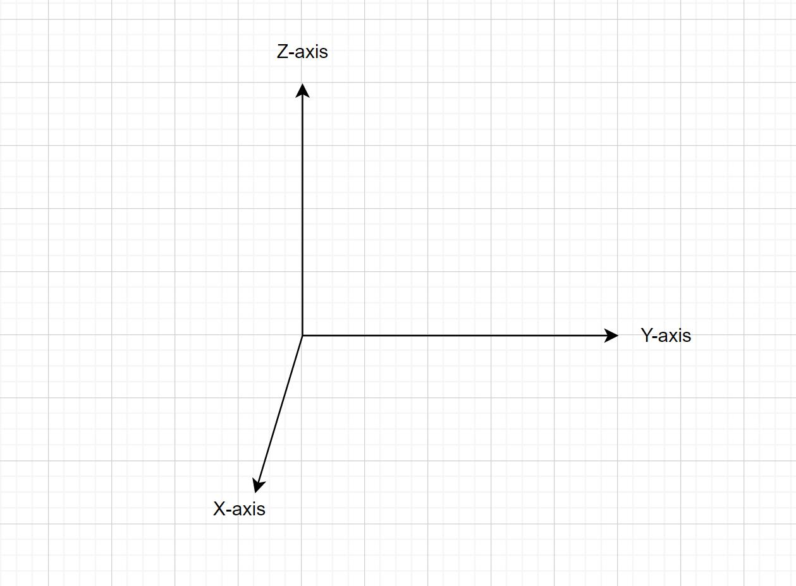
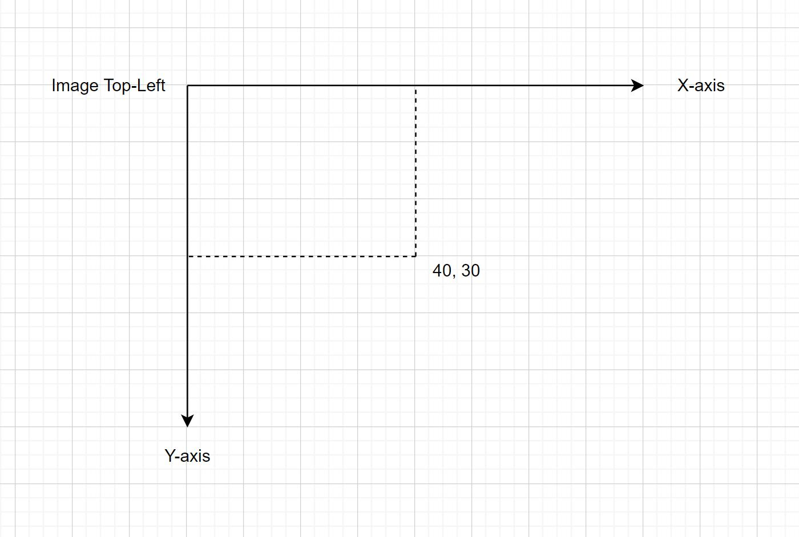
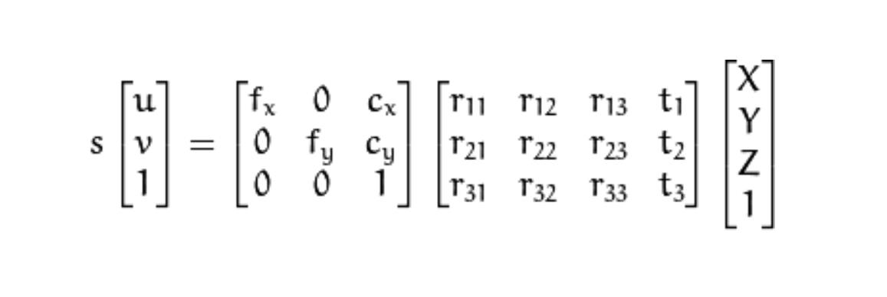
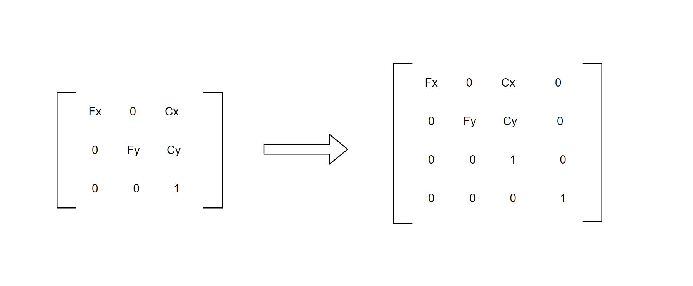
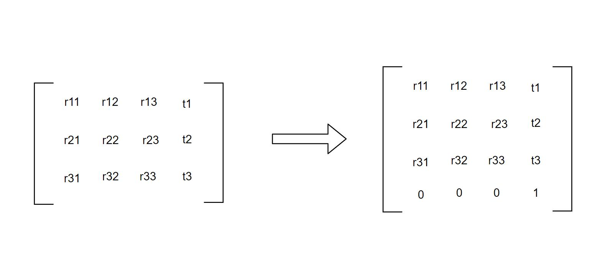
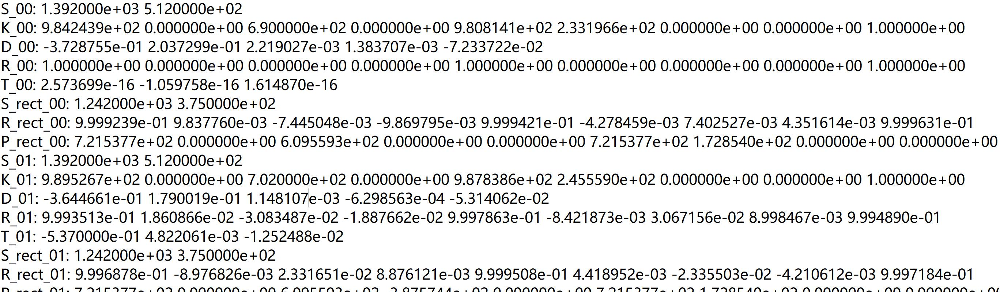
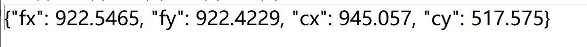
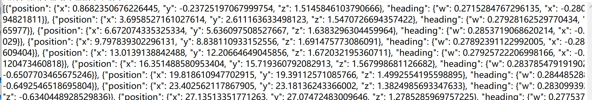

## 坐标系

点云标注工具主要有两种坐标系：3D坐标系和图片坐标系。

### 3D坐标系

点云工具3D场景采用右手坐标系，场景中点云数据的坐标系就是世界坐标系,点云的坐标系以Z轴向上(如下图)。

<div align=center></div>

> 3D标注结果的位置信息`position`就是相对点云坐标系的坐标值

### 图片坐标系

点云工具2/3映射中的图片源点在图片左上角，横向代表X轴，纵向代表Y轴，向右X值变大，向下Y值变大(如下图)。

<div align=center></div>

> 2D标注结果中坐标位置信息都是相对图片坐标系的值


## 相机参数(2/3D融合)

工具中的2/3D映射转换流程基本和通用数据集的转换流程保持一致的,转换参数中包括相机外参和相机内参。
相机参数[详情](./camera_config.md)


### 通用数据集转换

通用数据转换流程如下：点坐标 x 相机外参 x 相机内参 = 图片坐标
<div align=center></div>

* **X/Y/Z** : 点云坐标系坐标.
* **r11...t3** : 相机外参矩阵信息.
* **Fx/Fy/Cx/Cy** : 相机内参信息.
* **S(u,v)** : 图片坐标.

### 工具数据转换

工具的数据转换流程如下：
```
S(u,v) = M(internal) x M(external) x P
```
* **P** : 点云坐标系坐标.
* **M(internal)** : `4x4`内参矩阵(行序)
* **M(external)** : `4x4`外参矩阵(行序)

在构建到工具的相机参数时，需要把`4x3`或`3x3`矩阵填补成`4x4`矩阵，如下：

<div align=center></div>
<div align=center>内参转换</div>
</br>
<div align=center></div>
<div align=center>外参转换</div>

### 转换例子(Kitti)

Example data of Kitti
<div align=center></div>

A 3D point x in Velodyne LiDAR coordinates gets projected to a point y in the i’th camera image as:

```
y = P(i) @ R(0) @ Tvelo_cam @ x
```

Refer to [ kitti-coordinate-transformation ](https://towardsdatascience.com/kitti-coordinate-transformations-125094cd42fb)


Code with `Three.js`
```javascript
// Example: Calculate external matrix of camera 1

// camera 0 projection matrix as internal matrix
// 7.215377e+02 0.000000e+00 6.095593e+02 0.000000e+00
// 0.000000e+00 7.215377e+02 1.728540e+02 0.000000e+00
// 0.000000e+00 0.000000e+00 1.000000e+00 0.000000e+00
let P_rect_matrix_0 = createMatrixFrom4x3(config.cameras[0].P_rect);

// camera 1 projection matrix
// 7.215377e+02 0.000000e+00 6.095593e+02 -3.875744e+02
// 0.000000e+00 7.215377e+02 1.728540e+02 0.000000e+00
// 0.000000e+00 0.000000e+00 1.000000e+00 0.000000e+00
let P_rect_matrix_1 = createMatrixFrom4x3(config.cameras[1].P_rect);
// camera 0 rotate matrix
let R_rect_matrix_0 = createMatrixFrom3x3(config.R_rect);
// velodyne-camera transform
let RT_velo_to_cam_matrix = createMatrixFrom4x3(config.RT_velo_to_cam);

// external parameters
let external_matrix = new THREE.Matrix4().copy(P_rect_matrix_0).invert()
                    .multiply(P_rect_matrix_1)
                    .multiply(R_rect_matrix_0)
                    .multiply(RT_velo_to_cam_matrix);

// elements of THREE.Matrix4 is column-major, need to convert to row-major
external_matrix.transpose()
console.log(external_matrix.elements)
// [0.0002347736981472108,-0.9999441545437641,-0.010563477811052198,-0.5399474051919163,
// 0.010449407416592824,0.010565353641379319,-0.9998895741176488,-0.07510879138296463,
// 0.9999453885620024,0.00012436537838650657,0.010451302995668946,-0.2721327964058732,
// 0,0,0,1]

// internal parameters from camera 0 projection matrix
// fx: 7.215377e+02  fy: 7.215377e+02
// cx: 6.095593e+02  cy: 1.728540e+02


// tool function
// 3x3 convert to 4x4
function createMatrixFrom3x3(a: Array<number>): THREE.Matrix4 {
    return new THREE.Matrix4().set(a[0], a[1], a[2], 0, a[3], a[4], a[5], 0, a[6], a[7], a[8], 0, 0, 0, 0, 1);
}

// 4x3 convert to 4x4
function createMatrixFrom4x3(a: Array<number>): THREE.Matrix4 {
    return new THREE.Matrix4().set(a[0], a[1], a[2], a[3], a[4], a[5], a[6], a[7], a[8], a[9], a[10], a[11], 0, 0, 0, 1);
}

```

### 转换例子(PandaSet)

Example data of PandaSet

<div align=center>intrinsics.json</div>
<div align=center></div>
<div align=center>poses.json</div>
<div align=center></div>

Code with `Three.js`
```javascript
// poses parameter from poses.json
function createExternalMatrix(poses) {
    let quaternion = new THREE.Quaternion(pos.heading.x, pos.heading.y, pos.heading.z, pos.heading.w);
    let position = new THREE.Vector3(pos.position.x, pos.position.y, pos.position.z);
    let external_matrix = new THREE.Matrix4();
    external_matrix.compose(position, quaternion, new THREE.Vector3(1, 1, 1));

    // elements of THREE.Matrix4 is column-major, need to convert to row-major
    external_matrix.transpose()

    return external_matrix;
}

// internal parameters from intrinsics.json
// { fx: 933.4667, fy: 934.6754, cx: 896.4692, cy: 507.3557 }

```


